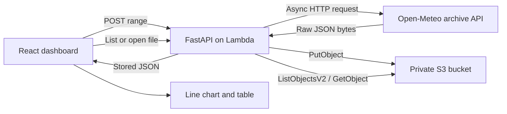

# InRisk Weather Explorer

[Live dashboard](https://inrisk-weather-explorer.vercel.app)


A full-stack weather archive built for the InRisk Labs engineering case study. A user requests up to 31 days of historical weather, the API saves the complete Open-Meteo response in a private S3 bucket, and the dashboard lists and visualizes those stored files.

## How it works



The browser never calls Open-Meteo directly. It works from saved objects after the initial fetch, which avoids duplicate provider calls and keeps cloud access inside the API.

## Repository layout

```text
backend/
  app/
    main.py          FastAPI routes and exception handlers
    models.py        Request validation and response models
    weather.py       Async Open-Meteo client
    storage.py       S3 adapter
    filenames.py     Safe object-name generation and validation
  tests/             Backend unit and route tests
frontend/
  src/
    components/      Input, file browser, chart, and table sections
    api.ts            Typed backend requests
    weather.ts        Stored JSON to chart/table row conversion
    App.tsx            Page state and workflow coordination
  src/App.test.tsx    Browser interaction tests
.github/workflows/    CI and manual backend deployment
template.yaml         AWS SAM infrastructure
```

The frontend and backend have independent dependencies and build commands. They share API contracts, not runtime code, so either side can be deployed or tested separately.

## Technology choices

| Area | Choice | Reason |
| --- | --- | --- |
| API | FastAPI + Pydantic | Async route support and explicit request validation |
| Storage | boto3 + S3 | Direct fit for object listing, upload, and retrieval |
| Lambda adapter | Mangum | Translates API Gateway events to ASGI requests |
| UI | React + TypeScript + Vite | Small client-only application with type-checked API data |
| Styling | Tailwind CSS | Responsive layout without a component framework |
| Chart | Recharts | Focused React line-chart primitives |
| Infrastructure | AWS SAM | Versioned Lambda, API Gateway, S3, IAM, and log configuration |

No database is needed because S3 objects are the application records. Redux is not used because the state belongs to one page and has no complex cross-route lifecycle.

## API

### `POST /store-weather-data`

```json
{
  "latitude": 12.9716,
  "longitude": 77.5946,
  "start_date": "2025-01-01",
  "end_date": "2025-01-10"
}
```

Coordinates must be in their geographic ranges. Dates must be valid, ordered, and span no more than 31 days inclusive. The API requests these daily variables:

- `temperature_2m_max`
- `temperature_2m_min`
- `apparent_temperature_max`
- `apparent_temperature_min`

Success response:

```json
{
  "status": "ok",
  "file": "weather_12.9716_77.5946_2025-01-01_2025-01-10_20250111T083000123456Z.json"
}
```

The exact Open-Meteo response bytes are stored rather than a reduced application model. That preserves provider metadata, units, timezone, and any fields that may be useful later.

### `GET /list-weather-files`

Returns S3 object names, sizes, and creation times. The storage adapter uses the SDK paginator instead of repeatedly scanning or guessing object names.

### `GET /weather-file-content/{file}`

Returns one stored JSON object. Only filenames generated by this application are accepted. Invalid and missing names both return:

```json
{
  "status": "error",
  "message": "not found"
}
```

Validation errors use HTTP 400, provider failures use 502, storage failures use 503, and missing files use 404.

## Async behavior

`OpenMeteoClient` awaits HTTPX directly because HTTPX provides asynchronous network I/O. boto3 is synchronous, so the storage adapter runs each S3 operation through `asyncio.to_thread`. This prevents a slow S3 request from blocking FastAPI's event loop while keeping the official AWS SDK.

Async does not make one request intrinsically faster. It allows the Lambda process to use waiting time for other work and keeps route handlers consistently non-blocking.

## Local setup

### Backend

Python 3.12 is used by Lambda and CI.

```powershell
cd backend
python -m venv .venv
.\.venv\Scripts\Activate.ps1
python -m pip install -r requirements-dev.txt
Copy-Item .env.example .env
```

Set `WEATHER_BUCKET_NAME` to a bucket your local AWS identity can access. Set `CORS_ORIGINS` to comma-separated browser origins. Do not commit `.env` or AWS credentials.

```powershell
uvicorn app.main:app --reload --env-file .env
```

The API is available at `http://localhost:8000` and its generated OpenAPI page is at `/docs`.

### Frontend

Node 24 is used locally and in CI.

```powershell
cd frontend
npm install
Copy-Item .env.example .env
npm run dev
```

`VITE_API_BASE_URL` must contain the backend origin without a trailing path.

## Tests and checks

Backend tests replace Open-Meteo and S3 at their dependency boundaries. They do not need credentials or make cloud calls.

```powershell
cd backend
.\.venv\Scripts\python.exe -m pytest -q
```

Frontend tests mock `fetch` and exercise behavior visible to the user.

```powershell
cd frontend
npm run lint
npm test
npm run build
```

CI runs all of these checks on pushes to `main` and on pull requests.

## AWS deployment

The stack targets `ap-south-1` and creates:

- A private, encrypted S3 bucket with all public-access blocks enabled.
- A 256 MB Python Lambda with a 20-second timeout and reserved concurrency of two.
- An API Gateway HTTP API throttled to two requests per second with a burst of five.
- A seven-day CloudWatch log group.
- IAM permissions limited to listing the bucket and reading/writing its objects.

### Before deploying

1. Check the AWS Billing and Free Tier pages for the account. Free Tier eligibility varies by account age and plan; the application is designed for tiny usage but cannot guarantee a zero bill.
2. Add a low AWS budget alert. A budget alert warns about spend; it is not a hard service shutdown.
3. Create a dedicated IAM deployment user. Do not create access keys for the AWS root user.
4. Give the deployment user the permissions required for CloudFormation, Lambda, API Gateway, IAM roles, S3, and CloudWatch Logs.
5. Create a GitHub environment named `production`, restrict its deployment branch to `main`, and add environment secrets named `AWS_ACCESS_KEY_ID` and `AWS_SECRET_ACCESS_KEY`.

Never put AWS credentials in `.env`, source files, workflow YAML, issues, or chat. GitHub encrypts Actions secrets and supplies them only while the deployment job runs. Delete or deactivate the deployment access key when the project no longer needs redeployment.

### Deploy the API

1. Open **Actions → Deploy backend → Run workflow**.
2. Confirm Free Tier eligibility.
3. Initially use `http://localhost:5173` for `cors_origins`.
4. Copy `ApiUrl` from the workflow's CloudFormation outputs.

The workflow builds on Ubuntu so Lambda receives Linux-compatible Python packages. It runs only when manually requested; normal pushes run tests but never change AWS.

### Deploy the dashboard on Vercel

1. Import this GitHub repository into a Vercel Hobby project.
2. Set the project root directory to `frontend`.
3. Set `VITE_API_BASE_URL` to the deployed `ApiUrl`.
4. Deploy and copy the resulting HTTPS origin.
5. Run the backend workflow again with both allowed origins, for example:
   `http://localhost:5173,https://inrisk-weather-explorer.vercel.app`

Vercel Hobby is intended for personal, non-commercial projects. Confirm its current terms before deployment.

## Verification status

- Locally verified: August 5, 2026
- Live URL: pending authenticated deployment
